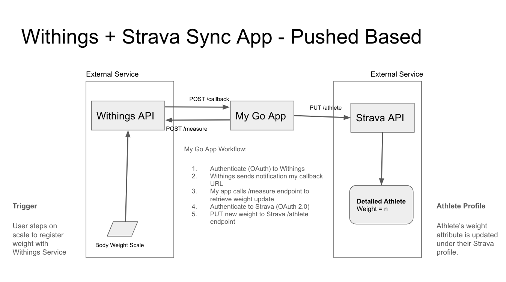

# withings-sync
An application to practice Go Lang: Sync's a user's weight from Withings API to a user's profile weight attribute in Strava.

## Strava API
* https://developers.strava.com/docs/reference/

## Withings API
* https://developer.withings.com/

## Design

